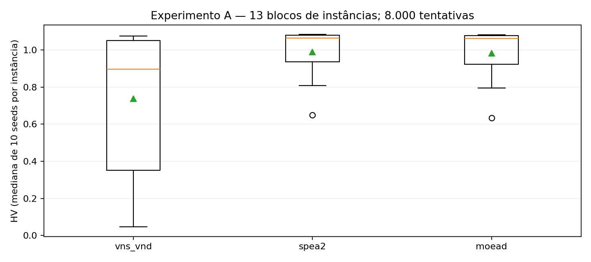
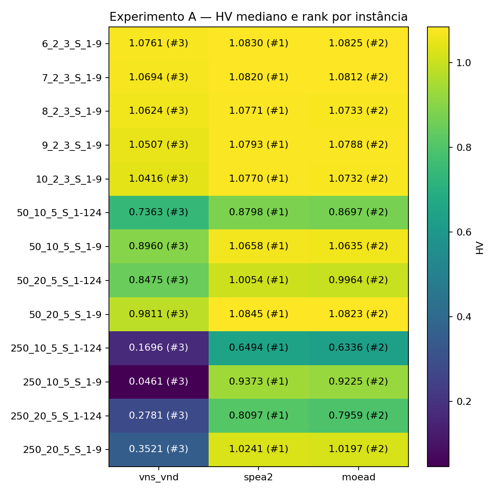
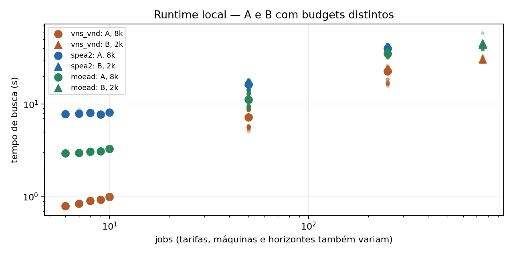
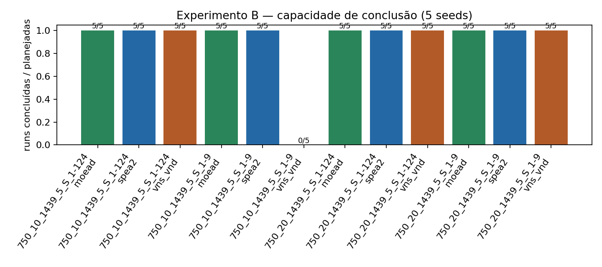
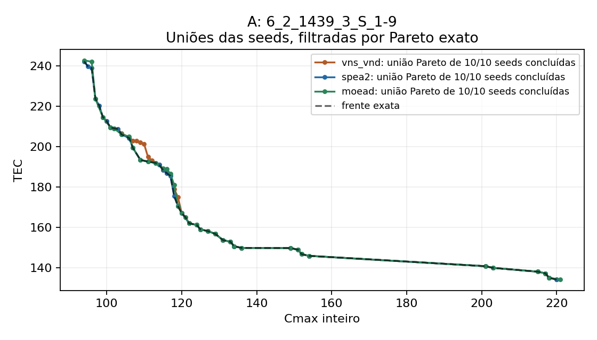
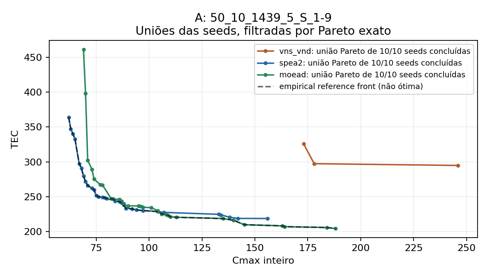
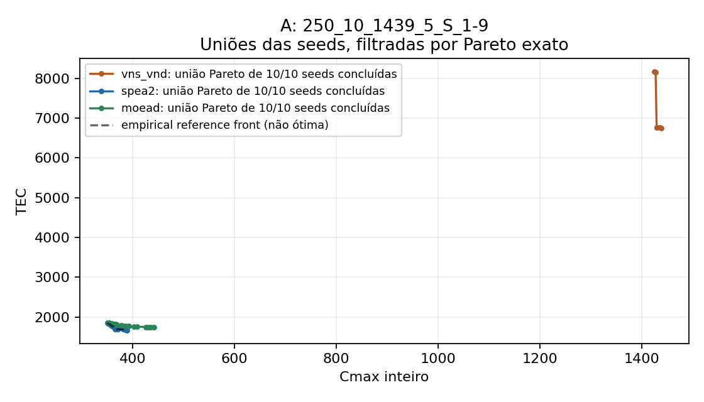
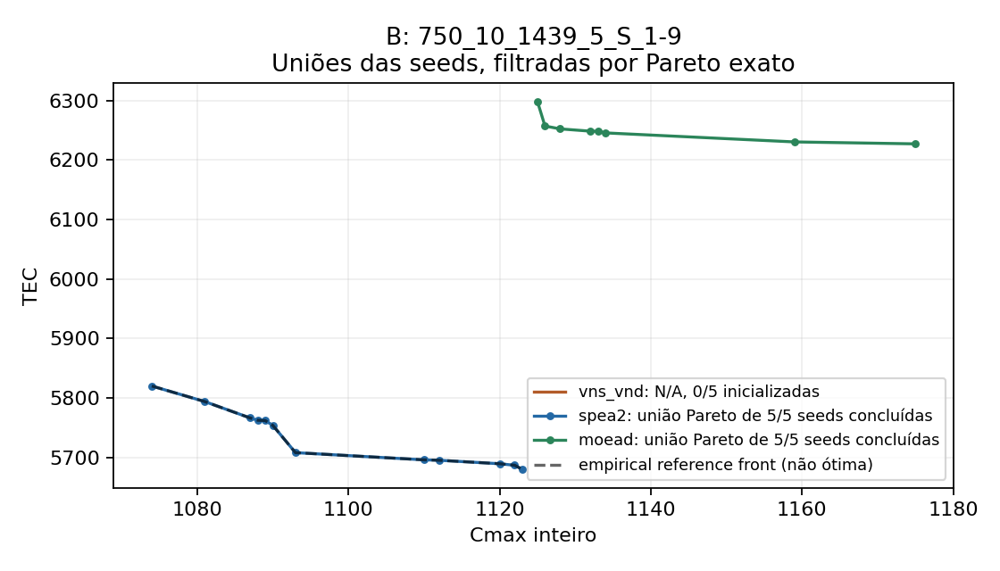

# Comparação final VNS/VND, SPEA2 e MOEA/D

Campanha sequencial com parâmetros congelados no checkpoint 40bf609. Os resultados separam qualidade multiobjetivo, robustez, custo e escala; não se escolhe vencedor pelo tamanho da frente, um extremo ou uma única instância.

## Inventário e protocolo

22 entradas: 17 originais e 5 derivadas (_derivada). A usa 13 originais de até 250 jobs × 3 algoritmos × 10 seeds × 8.000 tentativas = 390 runs e 3.120.000 tentativas. B usa as 4 originais de 750 jobs × 3 algoritmos × 5 seeds × 2.000 = 60 runs/120.000 tentativas. C usa 250_10_1439_5_S_1-9 × 3 algoritmos × 5 seeds × 20.000 = 15 runs/300.000 tentativas. Plano total: 465 células; ao fim 460 buscas concluídas e 5 falhas de inicialização, com 3,530,000 tentativas completas ao evaluator. B/C não entram na inferência global de A.

| Entrada | Jobs | Máquinas | Classe |
|---|---:|---:|---|
| data/input/set1/10_2_1439_3_S_1-9.dat | 10 | 2 | original |
| data/input/set1/10_2_1439_3_S_1-9_derivada.dat | 10 | 2 | derived |
| data/input/set1/11_2_1439_3_S_1-9_derivada.dat | 11 | 2 | derived |
| data/input/set1/12_2_1439_3_S_1-9_derivada.dat | 12 | 2 | derived |
| data/input/set1/13_2_1439_3_S_1-9_derivada.dat | 13 | 2 | derived |
| data/input/set1/14_2_1439_3_S_1-9_derivada.dat | 14 | 2 | derived |
| data/input/set1/6_2_1439_3_S_1-9.dat | 6 | 2 | original |
| data/input/set1/7_2_1439_3_S_1-9.dat | 7 | 2 | original |
| data/input/set1/8_2_1439_3_S_1-9.dat | 8 | 2 | original |
| data/input/set1/9_2_1439_3_S_1-9.dat | 9 | 2 | original |
| data/input/set2/250_10_1439_5_S_1-124.dat | 250 | 10 | original |
| data/input/set2/250_10_1439_5_S_1-9.dat | 250 | 10 | original |
| data/input/set2/250_20_1439_5_S_1-124.dat | 250 | 20 | original |
| data/input/set2/250_20_1439_5_S_1-9.dat | 250 | 20 | original |
| data/input/set2/50_10_1439_5_S_1-124.dat | 50 | 10 | original |
| data/input/set2/50_10_1439_5_S_1-9.dat | 50 | 10 | original |
| data/input/set2/50_20_1439_5_S_1-124.dat | 50 | 20 | original |
| data/input/set2/50_20_1439_5_S_1-9.dat | 50 | 20 | original |
| data/input/set2/750_10_1439_5_S_1-124.dat | 750 | 10 | original |
| data/input/set2/750_10_1439_5_S_1-9.dat | 750 | 10 | original |
| data/input/set2/750_20_1439_5_S_1-124.dat | 750 | 20 | original |
| data/input/set2/750_20_1439_5_S_1-9.dat | 750 | 20 | original |

Seeds A: 101,211,307,401,503,601,701,809,907,1009; B/C: primeiras cinco. VNS: initial_solutions=4, max_candidates_per_neighborhood=25, shaking_attempts=20. SPEA2: population_size=50, crossover_probability=.9, mutation_probability=.3, incremental (n_offsprings=1), normalize=False. MOEA/D: population_size=50 (50 directions), n_neighbors=20, prob_neighbor_mating=.9, crossover_probability=.9, mutation_probability=.3, Tchebycheff original. Ordem por bloco gira deterministicamente; lista integral no manifesto.

## Emendas metodológicas e reprodução

O protocolo original usava Cmax/H e TEC/max_cost no HV/IGD+. A primeira run (VNS, seed101, 250_10_1439_5_S_1-9, 8k) revelou TEC/max_cost>1.05 e foi interrompida imediatamente. Nesse momento somente uma run havia terminado; nenhum baseline havia sido lido e nenhuma métrica comparativa calculada. O histórico original foi preservado. A emenda 1 foi definida e validada antes da run2; não modificou algoritmos, seeds, operadores, budgets ou ordem. A primeira run foi preservada byte a byte e não repetida.

A segunda emenda registra a retomada, a falha oficial VNS/VND em 750_10_1439_5_S_1-9/seed 101 (200 construções, zero chamadas ao evaluator), a causa raiz confirmada independentemente como limitação do inicializador congelado e a decisão de manter o checkpoint 40bf609. O outcome foi materializado posteriormente do manifesto e diagnóstico oficial preservado, sem reexecução ou uso de /tmp. A célula conta como tentativa oficial; as demais células B seguem uma vez, na ordem congelada. Falhas iguais são outcomes; erros técnicos inesperados interrompem a campanha.

A escala EXTERNA dos indicadores usa C=(Cmax-C_LB)/(H-C_LB) e E=(tec_units-TEC_LB_units)/(TEC_UB_units-TEC_LB_units). C_LB=max(max_j dmin_j, ceil(sum_j dmin_j/m)). TEC_LB/UB somam os menores/maiores custos individuais entre todas as opções de máquina/modo/start inteiro no horizonte. A prova, tabela de bounds e validação de 327 runs piloto estão em [normalization_validation.md](normalization_validation.md). Todos os bounds são exatos e derivados só da entrada. Assertions garantem [0,1]² e dominância estrita pelo reference (1.05,1.05) antes de HV. IGD+ usa o mesmo espaço. max_cost permanece no diagnóstico e na escala INTERNA Cmax/H, TEC/max_cost do MOEA/D.

Dominância, coverage e deduplicação usam (Cmax inteiro, tec_units exato). Cada tentativa completa ao evaluator, incluindo inviáveis, conta; as contagens independentes confirmaram attempts==budget. Validações internas pós-busca e reavaliações independentes ficam separadas. Todas as frentes/schedules finais foram reavaliadas, confirmando viabilidade, objetivos exatos, unicidade e não dominância. Referências foram lidas/construídas somente após os outcomes terminais das 465 células planejadas. Empirical fronts são uniões reavaliadas e filtradas por Pareto exato de todos os algoritmos/seeds do mesmo experimento, não referências ótimas.

Início: 2026-10-07T19:16:00.037846+00:00; fim das buscas: 2026-10-08T15:25:02.232603+00:00. Duração ativa global das sessões: 9418.24 s; soma de timers de busca: 9123.50 s. Timers nativos incluem inicialização e busca, excluem validação final/escrita. Instrumentação de contagem adiciona overhead não quantificado. Memória não medida (RSS máximo do processo seria acumulado). Ambiente e hashes de código, entradas, scripts, bounds e outputs no manifesto; checkpoint conferido com normalização Git de EOL.

Reprodução: `python data/output/final_comparison/run_final.py`; retomada verifica artefatos e não repete runs completas. Análise: `python data/output/final_comparison/analyze_final.py --publish` (arquiva explicitamente resultados anteriores). Caches/logs ficam fora do repositório. Testes/py_compile/diff registrados em checks_amendment.json e final_checks.json.

## Qualidade, robustez, extremos e custo por instância

### Capacidade de inicialização no Experimento B

Sob o inicializador e protocolo congelados, VNS/VND não conseguiu inicializar determinadas instâncias/seeds de 750 jobs. Isso não prova inviabilidade geral; nessas células não há evidência sobre qualidade de busca. A qualidade agregada considera somente runs concluídas.

| Instância | Algoritmo | Planejadas | Concluídas | Falhas de inicialização | Taxa | N qualidade |
|---|---|---:|---:|---:|---:|---:|
| 750_10_1439_5_S_1-124.dat | moead | 5 | 5 | 0 | 100% | 5 |
| 750_10_1439_5_S_1-124.dat | spea2 | 5 | 5 | 0 | 100% | 5 |
| 750_10_1439_5_S_1-124.dat | vns_vnd | 5 | 5 | 0 | 100% | 5 |
| 750_10_1439_5_S_1-9.dat | moead | 5 | 5 | 0 | 100% | 5 |
| 750_10_1439_5_S_1-9.dat | spea2 | 5 | 5 | 0 | 100% | 5 |
| 750_10_1439_5_S_1-9.dat | vns_vnd | 5 | 0 | 5 | 0% | 0 |
| 750_20_1439_5_S_1-124.dat | moead | 5 | 5 | 0 | 100% | 5 |
| 750_20_1439_5_S_1-124.dat | spea2 | 5 | 5 | 0 | 100% | 5 |
| 750_20_1439_5_S_1-124.dat | vns_vnd | 5 | 5 | 0 | 100% | 5 |
| 750_20_1439_5_S_1-9.dat | moead | 5 | 5 | 0 | 100% | 5 |
| 750_20_1439_5_S_1-9.dat | spea2 | 5 | 5 | 0 | 100% | 5 |
| 750_20_1439_5_S_1-9.dat | vns_vnd | 5 | 5 | 0 | 100% | 5 |

summary.csv contém mediana, Q1, Q3, min e max por algoritmo/instância para todos os indicadores (10 seeds em A; 5 em B/C); quartis interpolados linearmente. metrics.csv e normalized_metrics.csv preservam cada run. Extremos Cmax/TEC são separados.

| Exp. | Entrada | Algoritmo | HV med. [Q1,Q3] | IGD+ med. | Cmax mín. med. | TEC mín. med. | Frente med. | Tempo s med. | Rejeição med. |
|---|---|---|---|---:|---:|---:|---:|---:|---:|
| A | 10_2_1439_3_S_1-9.dat | moead (n=10) | 1.073170 [1.070784,1.073422] | 0.002205 | 177 | 185.977 | 40 | 3.282 | 0.00% |
| A | 10_2_1439_3_S_1-9.dat | spea2 (n=10) | 1.077010 [1.074965,1.077964] | 0.001955 | 170.5 | 185.977 | 50 | 8.131 | 0.00% |
| A | 10_2_1439_3_S_1-9.dat | vns_vnd (n=10) | 1.041612 [1.035746,1.046418] | 0.009845 | 206.5 | 190.748 | 17.5 | 0.997 | 13.16% |
| A | 6_2_1439_3_S_1-9.dat | moead (n=10) | 1.082536 [1.081535,1.082822] | 0.001142 | 94.5 | 134.099 | 28.5 | 2.943 | 0.00% |
| A | 6_2_1439_3_S_1-9.dat | spea2 (n=10) | 1.082994 [1.082978,1.083048] | 0.000675 | 94 | 134.099 | 39.5 | 7.820 | 0.00% |
| A | 6_2_1439_3_S_1-9.dat | vns_vnd (n=10) | 1.076089 [1.067834,1.078855] | 0.002260 | 104.5 | 134.099 | 20 | 0.792 | 12.07% |
| A | 7_2_1439_3_S_1-9.dat | moead (n=10) | 1.081179 [1.081051,1.081753] | 0.000823 | 125 | 146.993 | 27 | 2.984 | 0.00% |
| A | 7_2_1439_3_S_1-9.dat | spea2 (n=10) | 1.081959 [1.081952,1.081969] | 0.000128 | 124 | 146.993 | 40 | 7.912 | 0.00% |
| A | 7_2_1439_3_S_1-9.dat | vns_vnd (n=10) | 1.069427 [1.067195,1.075816] | 0.003131 | 142 | 146.993 | 21.5 | 0.845 | 12.62% |
| A | 8_2_1439_3_S_1-9.dat | moead (n=10) | 1.073296 [1.072318,1.073931] | 0.002328 | 138.5 | 190.709 | 32.5 | 3.087 | 0.00% |
| A | 8_2_1439_3_S_1-9.dat | spea2 (n=10) | 1.077083 [1.075870,1.077342] | 0.001700 | 133 | 190.709 | 49.5 | 8.026 | 0.00% |
| A | 8_2_1439_3_S_1-9.dat | vns_vnd (n=10) | 1.062399 [1.060691,1.064306] | 0.005124 | 152 | 190.709 | 19.5 | 0.906 | 13.23% |
| A | 9_2_1439_3_S_1-9.dat | moead (n=10) | 1.078803 [1.078355,1.079146] | 0.001853 | 152.5 | 194.328 | 37 | 3.090 | 0.00% |
| A | 9_2_1439_3_S_1-9.dat | spea2 (n=10) | 1.079328 [1.079225,1.079384] | 0.001165 | 152 | 194.328 | 50 | 7.759 | 0.00% |
| A | 9_2_1439_3_S_1-9.dat | vns_vnd (n=10) | 1.050661 [1.047178,1.058364] | 0.006521 | 180.5 | 195.891 | 15 | 0.934 | 13.04% |
| A | 250_10_1439_5_S_1-124.dat | moead (n=10) | 0.633585 [0.630480,0.636802] | 0.014770 | 1718.5 | 4261.227 | 14.5 | 33.988 | 0.00% |
| A | 250_10_1439_5_S_1-124.dat | spea2 (n=10) | 0.649447 [0.648091,0.654340] | 0.010871 | 1675 | 3757.371 | 28.5 | 38.956 | 0.00% |
| A | 250_10_1439_5_S_1-124.dat | vns_vnd (n=10) | 0.169605 [0.162490,0.195482] | 0.446459 | 3740.5 | 5064.718 | 6 | 21.781 | 21.42% |
| A | 250_10_1439_5_S_1-9.dat | moead (n=10) | 0.922499 [0.919789,0.924573] | 0.012316 | 373.5 | 1887.703 | 10.5 | 32.739 | 0.00% |
| A | 250_10_1439_5_S_1-9.dat | spea2 (n=10) | 0.937296 [0.935673,0.939458] | 0.003910 | 359.5 | 1712.217 | 15.5 | 38.305 | 0.00% |
| A | 250_10_1439_5_S_1-9.dat | vns_vnd (n=10) | 0.046078 [0.045641,0.047672] | 0.872786 | 1436 | 6982.921 | 3 | 17.048 | 47.23% |
| A | 250_20_1439_5_S_1-124.dat | moead (n=10) | 0.795905 [0.793844,0.797503] | 0.014417 | 693.5 | 3841.485 | 12.5 | 37.866 | 0.00% |
| A | 250_20_1439_5_S_1-124.dat | spea2 (n=10) | 0.809652 [0.804664,0.813125] | 0.013632 | 687 | 3364.793 | 28.5 | 43.480 | 0.00% |
| A | 250_20_1439_5_S_1-124.dat | vns_vnd (n=10) | 0.278053 [0.250666,0.310484] | 0.464954 | 2137.5 | 6162.391 | 3.5 | 24.949 | 17.44% |
| A | 250_20_1439_5_S_1-9.dat | moead (n=10) | 1.019718 [1.019330,1.021094] | 0.004016 | 140 | 1399.306 | 7.5 | 35.374 | 0.00% |
| A | 250_20_1439_5_S_1-9.dat | spea2 (n=10) | 1.024136 [1.023808,1.025394] | 0.001723 | 138.5 | 1288.011 | 11.5 | 40.122 | 0.00% |
| A | 250_20_1439_5_S_1-9.dat | vns_vnd (n=10) | 0.352141 [0.338905,0.393424] | 0.614009 | 977.5 | 5687.291 | 4 | 23.418 | 17.88% |
| A | 50_10_1439_5_S_1-124.dat | moead (n=10) | 0.869656 [0.853665,0.880021] | 0.020254 | 301 | 396.930 | 12.5 | 9.576 | 0.00% |
| A | 50_10_1439_5_S_1-124.dat | spea2 (n=10) | 0.879771 [0.877769,0.886221] | 0.017210 | 292.5 | 350.387 | 18.5 | 14.466 | 0.00% |
| A | 50_10_1439_5_S_1-124.dat | vns_vnd (n=10) | 0.736310 [0.711518,0.752371] | 0.093729 | 482 | 466.806 | 6 | 5.695 | 17.38% |
| A | 50_10_1439_5_S_1-9.dat | moead (n=10) | 1.063534 [1.062993,1.064318] | 0.004799 | 72 | 228.109 | 19.5 | 9.186 | 0.00% |
| A | 50_10_1439_5_S_1-9.dat | spea2 (n=10) | 1.065775 [1.065066,1.067277] | 0.003580 | 67.5 | 243.196 | 20.5 | 13.920 | 0.00% |
| A | 50_10_1439_5_S_1-9.dat | vns_vnd (n=10) | 0.896042 [0.884085,0.918992] | 0.129191 | 275 | 325.574 | 5.5 | 5.567 | 11.90% |
| A | 50_20_1439_5_S_1-124.dat | moead (n=10) | 0.996436 [0.989016,1.000907] | 0.011347 | 126.5 | 295.796 | 11 | 12.974 | 0.00% |
| A | 50_20_1439_5_S_1-124.dat | spea2 (n=10) | 1.005385 [1.004017,1.007180] | 0.010561 | 116 | 262.021 | 14 | 17.855 | 0.00% |
| A | 50_20_1439_5_S_1-124.dat | vns_vnd (n=10) | 0.847461 [0.842919,0.853240] | 0.108539 | 320 | 345.742 | 7 | 8.731 | 11.99% |
| A | 50_20_1439_5_S_1-9.dat | moead (n=10) | 1.082299 [1.080443,1.084048] | 0.003490 | 33.5 | 147.309 | 9.5 | 13.062 | 0.00% |
| A | 50_20_1439_5_S_1-9.dat | spea2 (n=10) | 1.084489 [1.083478,1.086009] | 0.001920 | 30.5 | 151.968 | 12.5 | 17.823 | 0.00% |
| A | 50_20_1439_5_S_1-9.dat | vns_vnd (n=10) | 0.981120 [0.958605,0.983535] | 0.087955 | 163.5 | 220.247 | 5 | 8.770 | 9.34% |
| B | 750_10_1439_5_S_1-124.dat | moead (n=5) | 0.712422 [0.711424,0.716459] | 0.006584 | 5272 | 18742.597 | 19 | 42.570 | 0.00% |
| B | 750_10_1439_5_S_1-124.dat | spea2 (n=5) | 0.728411 [0.727459,0.728845] | 0.005384 | 5192 | 16895.673 | 26 | 43.360 | 0.00% |
| B | 750_10_1439_5_S_1-124.dat | vns_vnd (n=5) | 0.431635 [0.401034,0.438583] | 0.242841 | 10375 | 24464.656 | 6 | 32.028 | 0.50% |
| B | 750_10_1439_5_S_1-9.dat | moead (n=5) | 0.815995 [0.813333,0.816163] | 0.019431 | 1135 | 6444.699 | 7 | 39.362 | 0.00% |
| B | 750_10_1439_5_S_1-9.dat | spea2 (n=5) | 0.842956 [0.836858,0.844592] | 0.002482 | 1082 | 5908.540 | 12 | 41.181 | 0.00% |
| B | 750_10_1439_5_S_1-9.dat | vns_vnd | N/A — initialization_failed | N/A | N/A | N/A | N/A | N/A | N/A |
| B | 750_20_1439_5_S_1-124.dat | moead (n=5) | 0.773302 [0.773062,0.773932] | 0.003115 | 2162 | 12927.130 | 21 | 45.138 | 0.00% |
| B | 750_20_1439_5_S_1-124.dat | spea2 (n=5) | 0.781661 [0.780975,0.782522] | 0.004134 | 2132 | 11621.357 | 24 | 46.653 | 0.00% |
| B | 750_20_1439_5_S_1-124.dat | vns_vnd (n=5) | 0.341589 [0.336710,0.364682] | 0.368078 | 5775 | 21434.229 | 6 | 30.478 | 0.50% |
| B | 750_20_1439_5_S_1-9.dat | moead (n=5) | 0.981305 [0.981299,0.982007] | 0.002662 | 432 | 4264.221 | 10 | 44.095 | 0.00% |
| B | 750_20_1439_5_S_1-9.dat | spea2 (n=5) | 0.984067 [0.983078,0.986219] | 0.001848 | 428 | 4043.066 | 13 | 45.532 | 0.00% |
| B | 750_20_1439_5_S_1-9.dat | vns_vnd (n=5) | 0.092861 [0.086513,0.114271] | 0.865875 | 2722 | 20703.140 | 7 | 29.129 | 1.25% |
| C | 250_10_1439_5_S_1-9.dat | moead (n=5) | 0.929256 [0.928989,0.929603] | 0.007881 | 371 | 1687.352 | 17 | 75.180 | 0.00% |
| C | 250_10_1439_5_S_1-9.dat | spea2 (n=5) | 0.941048 [0.936150,0.944587] | 0.004908 | 361 | 1572.988 | 18 | 86.542 | 0.00% |
| C | 250_10_1439_5_S_1-9.dat | vns_vnd (n=5) | 0.047655 [0.047397,0.047702] | 0.861836 | 1436 | 5847.944 | 4 | 41.044 | 45.05% |

## Inferência do Experimento A

Unidade: instância; três medianas de HV por instância, com 13 blocos. Seeds não são problemas independentes. Friedman global, Wilcoxon signed-rank somente se significativo, Holm nas três comparações e correlação rank-biserial pareada. IGD+ é confirmação secundária com família de comparações separada. P-values do Friedman são assintóticos e devem ser interpretados com cautela com 13 blocos; isto não estima superioridade em todo benchmark.

hv: Friedman χ²=26.000000, p=2.26033e-06, Kendall W=1.000000.
- vns_vnd vs spea2: p=0.000244141, Holm=0.000732422, rank-biserial=-1.000000, diferença mediana=-0.143461. Diferença significativa após Holm.
- vns_vnd vs moead: p=0.000244141, Holm=0.000732422, rank-biserial=-1.000000, diferença mediana=-0.133345. Diferença significativa após Holm.
- spea2 vs moead: p=0.000244141, Holm=0.000732422, rank-biserial=1.000000, diferença mediana=0.003840. Diferença significativa após Holm.

igd_plus: Friedman χ²=26.000000, p=2.26033e-06, Kendall W=1.000000.
- vns_vnd vs spea2: p=0.000244141, Holm=0.000732422, rank-biserial=1.000000, diferença mediana=0.086035. Diferença significativa após Holm.
- vns_vnd vs moead: p=0.000244141, Holm=0.000732422, rank-biserial=1.000000, diferença mediana=0.084466. Diferença significativa após Holm.
- spea2 vs moead: p=0.000244141, Holm=0.000732422, rank-biserial=-1.000000, diferença mediana=-0.000786. Diferença significativa após Holm.

## Comparações pareadas e baselines

paired_comparisons.csv alinha instância+seed+budget, reporta HV/IGD+/extremos/tamanho/tempo/rejeição dos dois algoritmos e ambas as direções C(A,B)/C(B,A). Coverage é a fração da frente alvo fracamente dominada (inclui igualdade), não um indicador simétrico.

exact_baseline_metrics.csv contém coincidências exatas, pontos estritamente dominados pela frente exata, possíveis conflitos (devem ser zero), HV exato, HV_alg/HV_exato, IGD+ exato e coverage nos dois sentidos. Baselines complete+pareto_proven são carregados somente após as buscas e têm hash conferido. Nenhum aproximado dominou estritamente um ponto de baseline complete+pareto_proven; caso contrário a análise teria parado.

| Entrada | Algoritmo | Iguais med. | Dominados med. | HV_alg/HV_exato med. | IGD+ exato med. |
|---|---|---:|---:|---:|---:|
| 10_2_1439_3_S_1-9.dat | moead | 6.5 | 31.5 | 0.994847 | 0.002205 |
| 10_2_1439_3_S_1-9.dat | spea2 | 4 | 46 | 0.998407 | 0.001955 |
| 10_2_1439_3_S_1-9.dat | vns_vnd | 2 | 15 | 0.965593 | 0.009845 |
| 6_2_1439_3_S_1-9.dat | moead | 16.5 | 13 | 0.999439 | 0.001142 |
| 6_2_1439_3_S_1-9.dat | spea2 | 26 | 13 | 0.999862 | 0.000675 |
| 6_2_1439_3_S_1-9.dat | vns_vnd | 11 | 8 | 0.993486 | 0.002260 |
| 7_2_1439_3_S_1-9.dat | moead | 20.5 | 6 | 0.999263 | 0.000823 |
| 7_2_1439_3_S_1-9.dat | spea2 | 36.5 | 3.5 | 0.999984 | 0.000128 |
| 7_2_1439_3_S_1-9.dat | vns_vnd | 14 | 6.5 | 0.988402 | 0.003131 |
| 8_2_1439_3_S_1-9.dat | moead | 11.5 | 20.5 | 0.994930 | 0.002328 |
| 8_2_1439_3_S_1-9.dat | spea2 | 6.5 | 37 | 0.998441 | 0.001700 |
| 8_2_1439_3_S_1-9.dat | vns_vnd | 4 | 15.5 | 0.984829 | 0.005124 |
| 9_2_1439_3_S_1-9.dat | moead | 0 | 33.5 | 0.998666 | 0.001853 |
| 9_2_1439_3_S_1-9.dat | spea2 | 1 | 49 | 0.999151 | 0.001165 |
| 9_2_1439_3_S_1-9.dat | vns_vnd | 4 | 11 | 0.972614 | 0.006521 |

## Escalabilidade e profundidade

B mede 750 jobs a 2k tentativas: custo por tentativa, rejeição e diversidade estão em summary.csv. Não extrapolar tempo de A a B sem considerar budgets, tarifas, máquinas e horizonte. B não participa dos testes de A. C compara 20k com as mesmas cinco seeds de A/8k, sem redefinir budget principal. budget_depth_comparisons.csv registra ganhos de HV/IGD+ e coverage bidirecional por algoritmo/seed; referências empíricas distintas por experimento tornam IGD+ entre budgets um diagnóstico com referências distintas. HV é diretamente comparável por ter mesmos bounds e reference point.

| Algoritmo | ΔHV 20k−8k med. | Melhorou HV | Tempo 20k/8k med. |
|---|---:|---:|---:|
| vns_vnd | 0.002042 | 5/5 | 2.394 |
| spea2 | 0.005343 | 5/5 | 2.249 |
| moead | 0.005525 | 5/5 | 2.302 |

## Figuras

## Limitações e conclusão sustentada

Melhor HV mediano por instância de A (empates contados): vns_vnd: 0/13, spea2: 13/13, moead: 0/13. A inferência acima distingue diferenças sustentadas de ordenações apenas descritivas. A robustez deve ser lida pelos IQRs/faixas, não apenas pela mediana. Tempos refletem implementações e overheads distintos, não eficiência isolada do operador.

Qualidade multiobjetivo: HV e IGD+ caracterizam o compromisso entre os dois objetivos, com coverage pareada e extremos como diagnósticos. A normalização a priori é válida mas seus limites individuais podem ser frouxos, comprimindo TEC e afetando o peso geométrico relativo no HV/IGD+. Não se substituiu a escala por extremos observados. Nas instâncias sem baseline exato, IGD+ usa referência empírica limitada aos algoritmos/seeds, sem garantia de ótima.

SPEA2 é incremental, não geracional clássico, e normalize=False torna a densidade sensível às unidades originais. MOEA/D usa escala interna fixa Cmax/H e TEC/max_cost; directions uniformes não garantem cobertura uniforme, e fallback de inviabilidade pode afetar exploração mesmo se não ocorrer. VNS/VND busca por arquivo Pareto e rejeições inviáveis podem consumir parte substancial do budget. Esses fatores ajudam a interpretar diferenças por classe/tamanho e impedem atribuir todos os efeitos ao nome abstrato do algoritmo.

Os resultados de B e C são secundários: verificam custo/escala e sensibilidade ao budget, não substituem a comparação A. Nenhum ranking universal é inferido de pontos extras, um extremo isolado, rapidez ou uma única entrada. Nenhum algoritmo foi modificado ou retunado, e não houve commit/push.
