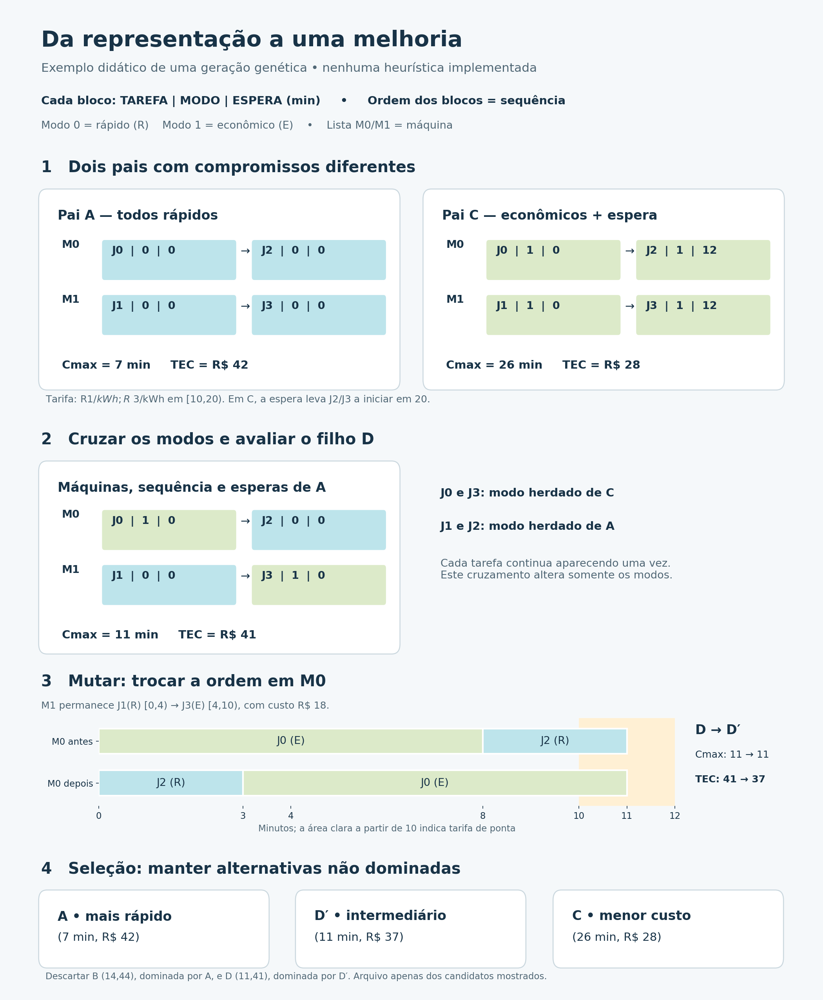

# Representação proposta para heurísticas e metaheurísticas

A API reutilizável desta representação está em `src/schedule.py`: `Schedule` formaliza as listas por máquina, `evaluate_schedule` valida/decodifica e `schedule_from_result_rows` converte schedules já serializados. A avaliação expõe Cmax inteiro e TEC por unidades inteiras/escala; floats são apenas uma visão para bibliotecas e campos legados de saída. Os métodos exatos mantêm suas próprias rotinas e formatos, mas usam a mesma matemática de intervalo energético em `src/problem.py`.

Usar uma lista ordenada de tarefas para cada máquina. Cada item contém `(job, modo, espera)`. A posição do item define a sequência; a lista que o contém define a máquina. Todos os índices começam em zero. `espera` é um número inteiro de intervalos adicionais depois do término do predecessor e do setup obrigatório.

| Campo | Significado | Restrição |
| --- | --- | --- |
| Lista da máquina | Índice da máquina que executa seus itens | De 0 a m−1; pode estar vazia |
| job | Identificador da tarefa | De 0 a n−1; cada tarefa aparece uma vez |
| modo | Índice da velocidade e do fator de potência da entrada | De 0 a o−1 |
| espera | Folga antes do processamento, além do setup obrigatório | Inteiro ≥ 0, em intervalos da entrada |
| Posição | Ordem dentro da lista | Determina o predecessor e seu setup |

O significado do modo vem da entrada; modo 0 não representa universalmente a mesma velocidade. Inícios, términos e objetivos são calculados, evitando guardar valores redundantes inconsistentes.

## Exemplo visual: uma geração genética



**Exemplo didático, sem implementação de algoritmo genético e sem vínculo com os experimentos do artigo.** Quatro tarefas J0…J3, duas máquinas de 60 kW, horizonte de 60 minutos, intervalos de um minuto e setups zero. A tarifa vale R$ 1/kWh, exceto em [10,20), quando vale R$ 3/kWh. Espera e setup não cobram energia.

| Tarefa | Processamento base em M0 (min) | Em M1 (min) |
| --- | ---: | ---: |
| J0 | 8 | 12 |
| J1 | 12 | 8 |
| J2 | 6 | 10 |
| J3 | 10 | 6 |

| Inteiro do modo | Símbolo | Velocidade | Fator de potência | Potência resultante |
| --- | --- | ---: | ---: | ---: |
| 0 | R: rápido | 2 | 3 | 180 kW |
| 1 | E: econômico | 1 | 1 | 60 kW |

Por exemplo, **(J2, 0, 0)** em M0 significa tarefa 2, modo rápido e nenhuma espera: dura ceil(6/2) = 3 minutos. **(J2, 1, 12)** significa modo econômico e 12 minutos adicionais de folga. No pai C, J0 termina em 8 e J2 inicia em 8+12 = 20, depois da ponta, durando 6 minutos.

1. **População.** A usa todos os modos rápidos, sem espera: M0 executa J0→J2; M1 executa J1→J3. C usa as mesmas sequências com modos econômicos e 12 minutos de espera antes de J2 e J3. B usa modos econômicos sem espera e é dominada por A.
2. **Cruzamento dos modos.** D mantém máquinas, ordem e esperas de A, herdando os modos de J0 e J3 de C e os de J1 e J2 de A. Cada tarefa continua aparecendo uma vez. Um cruzamento geral de sequências precisará preservar ou reparar a unicidade dos jobs.
3. **Mutação/vizinho.** Trocar a ordem dos itens de M0 produz J2 rápido→J0 econômico, mantendo M1 igual. Cmax permanece 11; TEC cai de 41 para 37. Antes, um minuto de J2 rápido na ponta custava R$ 9; depois, o minuto na ponta pertence a J0 econômico e custa R$ 3. A redistribuição dos minutos fora de ponta resulta em economia líquida de R$ 4.
4. **Seleção Pareto.** Entre os candidatos mostrados, manter A, D′ e C; descartar B e D. Esse arquivo é não dominado entre as alternativas do exemplo, sem certificação de fronteira global dessa instância didática.

| Solução | M0: tarefa / modo / espera | M1: tarefa / modo / espera | Cmax (min) | TEC (R$) |
| --- | --- | --- | ---: | ---: |
| A | J0 / 0 / 0 → J2 / 0 / 0 | J1 / 0 / 0 → J3 / 0 / 0 | 7 | 42 |
| B | J0 / 1 / 0 → J2 / 1 / 0 | J1 / 1 / 0 → J3 / 1 / 0 | 14 | 44 |
| C | J0 / 1 / 0 → J2 / 1 / 12 | J1 / 1 / 0 → J3 / 1 / 12 | 26 | 28 |
| D | J0 / 1 / 0 → J2 / 0 / 0 | J1 / 0 / 0 → J3 / 1 / 0 | 11 | 41 |
| D′ | J2 / 0 / 0 → J0 / 1 / 0 | J1 / 0 / 0 → J3 / 1 / 0 | 11 | 37 |

Um algoritmo genético real não garante melhoria a cada filho/mutação. O exemplo mostra uma melhoria possível e o compromisso entre objetivos; um arquivo elitista pode preservar as alternativas já encontradas.

Cada job deve aparecer exatamente uma vez, e máquinas vazias são permitidas. Os modos devem existir na entrada; esperas são inteiras e não negativas.

## Decodificação e avaliação

Para a primeira tarefa da máquina, `inicio = espera`, pois o modelo não tem setup inicial. Para as demais:

```
inicio[j] = termino[anterior] + setup[maquina][anterior][j] + espera[j]
duracao[j] = ceil(processing[j][maquina] / velocidade[modo[j]])
termino[j] = inicio[j] + duracao[j]
```

O makespan é o maior término entre todas as tarefas. A energia considera a potência da máquina, o fator do modo e a tarifa em cada parte do intervalo `[inicio,termino)`, multiplicados pelas horas por intervalo (`24 / slots_per_day`). Setups e esperas não cobram energia, mas deslocam o processamento. Términos acima de `H` tornam a solução inviável.

Esta representação alcança qualquer escalonamento viável do modelo: ordenar as tarefas pelos inícios em cada máquina e definir a espera como a folga depois do predecessor/setup reconstrói seus horários. Manter apenas máquina, sequência e modo, sempre iniciando o mais cedo possível, restringiria soluções que usam espera para aproveitar tarifas mais baratas.

## Movimentos de vizinhança

| Movimento | Alteração | Efeito que precisa ser reavaliado |
| --- | --- | --- |
| Troca na mesma máquina | Trocar dois jobs de posição | Setups, durações e horários do trecho afetado |
| Troca entre máquinas | Trocar dois jobs entre listas | Processamentos dependentes da máquina, potência e setups |
| Inserção | Remover um job e inserir em outra posição ou máquina | A sequência e os horários das máquinas envolvidas |
| Mudança de modo | Trocar o modo de um job | Duração, potência relativa e horários posteriores |
| Ajuste de espera | Aumentar ou diminuir a espera de um job | Horários desse job e dos seus sucessores; possível mudança de tarifa |
| Inversão de trecho | Inverter um segmento da sequência | Todos os setups do trecho, pois podem ser assimétricos |

Uma troca ou inserção movimenta o item inteiro `(job, modo, espera)`; outro movimento pode ajustar o modo/espera depois. Ao diminuir espera, respeitar zero. Reavaliar a viabilidade depois de todo movimento: a representação evita jobs duplicados quando os operadores são bem definidos, mas não garante término dentro do horizonte. Uma primeira versão pode rejeitar movimentos inviáveis; uma estratégia de reparo exigirá uma definição própria.

Para acelerar a avaliação, recalcular a partir da primeira posição alterada somente nas máquinas envolvidas. Um prefixo da tarifa permite calcular a energia de cada tarefa por diferença de somas acumuladas em tempo constante. As avaliações de referência devem manter frações ou inteiros escalados para evitar inconsistências na dominância.

## Uso multiobjetivo e referências

A avaliação retorna `(makespan, TEC)`. Um arquivo externo de soluções mantém as alternativas não dominadas encontradas; o algoritmo precisa definir sua regra de seleção entre vizinhos com objetivos conflitantes. A representação, isoladamente, não escolhe pesos nem preferência entre os objetivos.

Os JSONs em `data/baselines/*_custom_exact_dp.json` contêm uma fronteira completa e um schedule para cada par. É possível converter cada schedule para esta representação: ordenar por máquina/início e calcular cada espera residual pela fórmula acima. O hash do arquivo de entrada deve coincidir antes de comparar uma solução aproximada com o baseline. Duas sequências diferentes com o mesmo par de objetivos correspondem ao mesmo ponto da fronteira.

O VNS/VND manual implementa N1–N5, shaking e arquivo Pareto sem crowding em `src/metaheuristics/vns_vnd.py`. Ele usa esta representação e as funções comuns de validação, avaliação, dominância e serialização; MOEA/D e SPEA2 seguem como etapas futuras.
